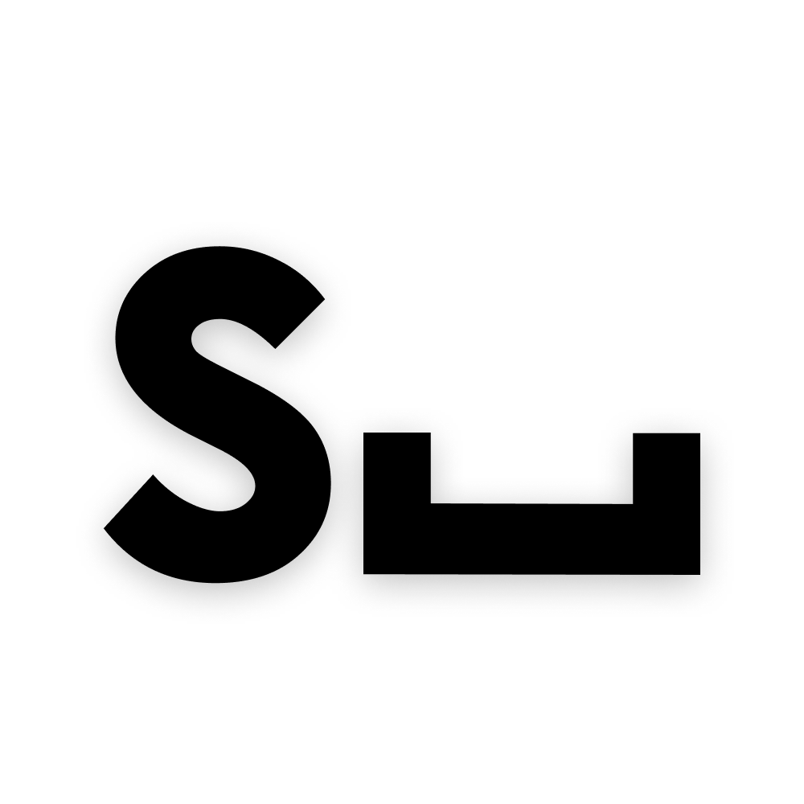
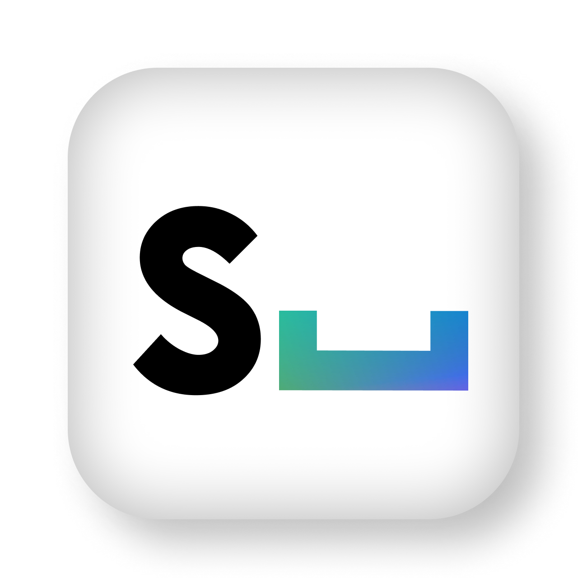
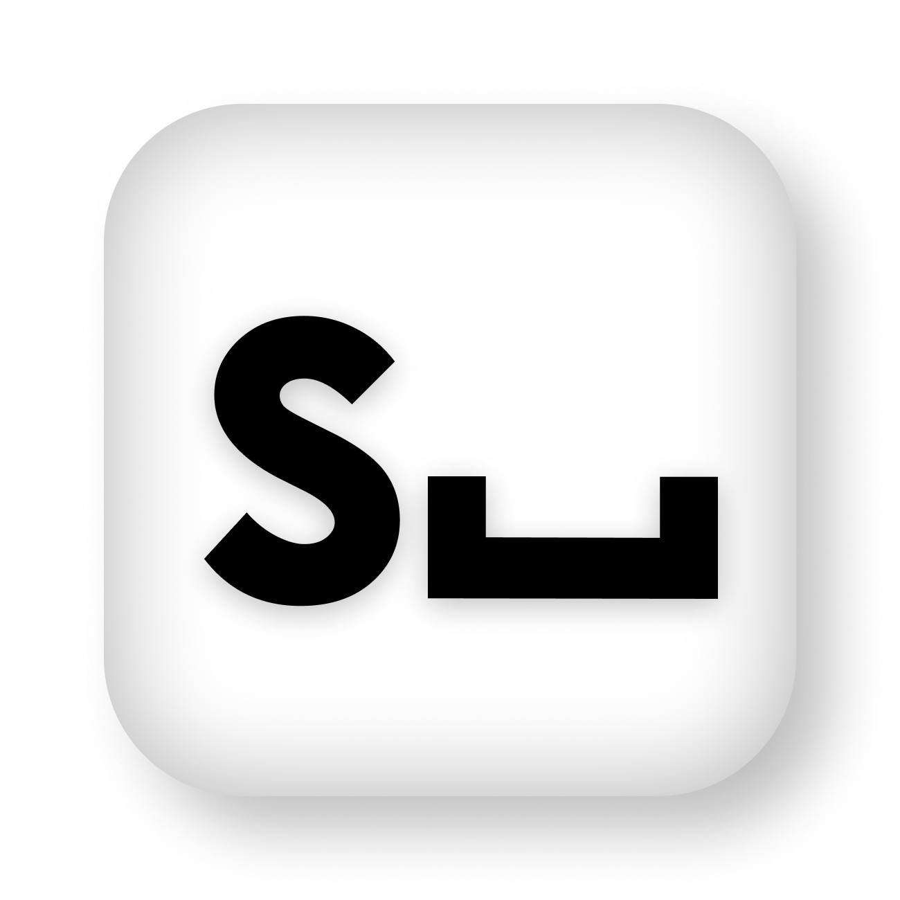
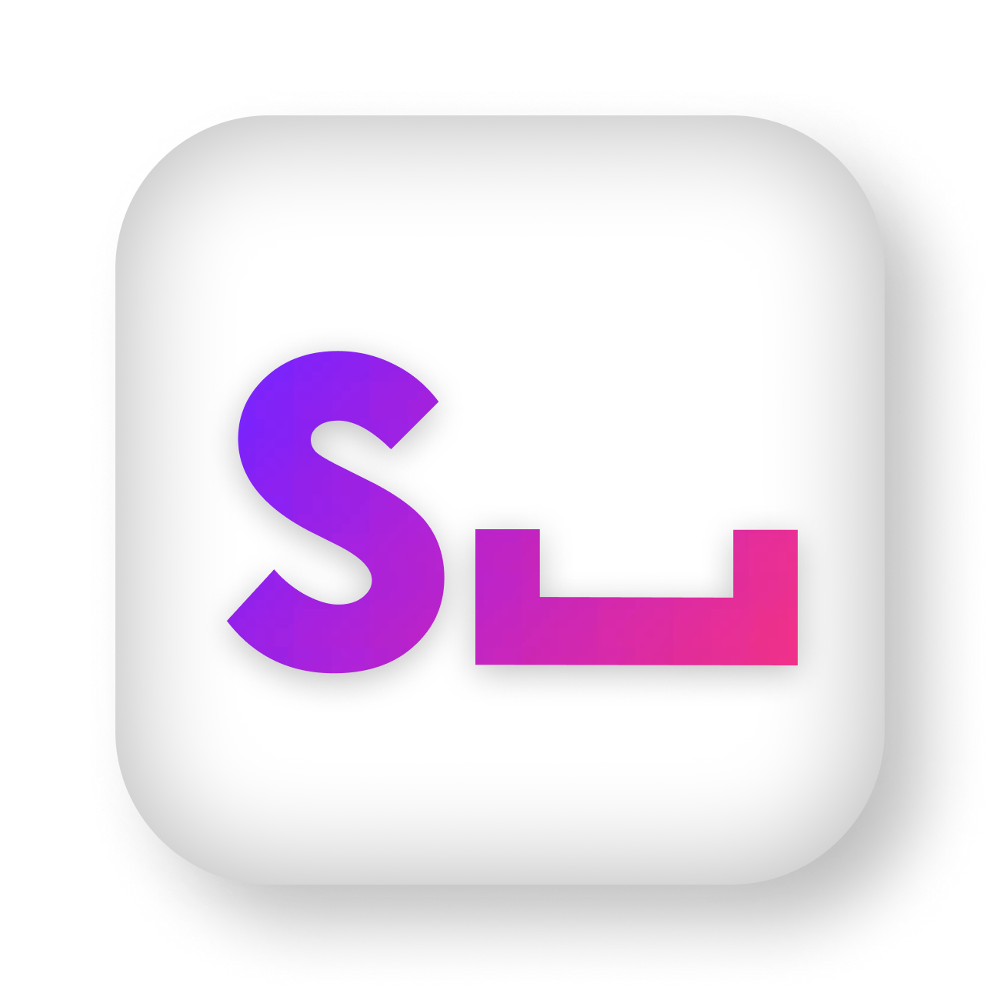
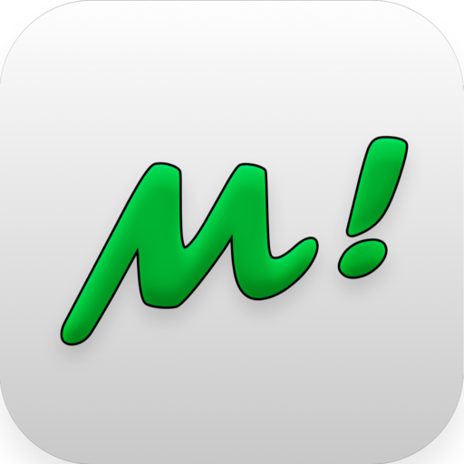

<h1 style="display: flex; align-items: center; flex-direction: column;">
    
    Space Software
</h1>

----------------------------------------------------------

<h2 style="display: flex; align-items: center;">
	
	About Us
</h2>

We are new sofware studio founded by 3 highschool students from Slovakia.

Our vision to future is to get better at app development and make apps that make world better place to live.

----------------------------------------------------------

<h2 style="display: flex; align-items: center;">
	
	Technologies & Languages
</h2>

We are a part of a experimental schooling program [OpenLab](https://openlab.sk/) where we started with web development in [Vue 3](https://vuejs.org/), [Ionic](https://ionicframework.com/) and [October CMS](https://octobercms.com/).

 
 

In the near future we would like to broaden our list of technologies & languages to get better in programming and to be able to create nicer & more functional apps or tools.

----------------------------------------------------------

<h2 style="display: flex; align-items: center;">
	
	Projects
</h2>

The first project we have done is [ MemeTime](https://github.com/SpaceSoftwareDev/MemeTimeApp)  It is currently close source but might be opensourced in the future

The second project we have done is a static website which is [ Our Website](https://github.com/SpaceSoftwareDev/Website)

Both of the projects are still work in progress & may change functionality or design frequently

----------------------------------------------------------
